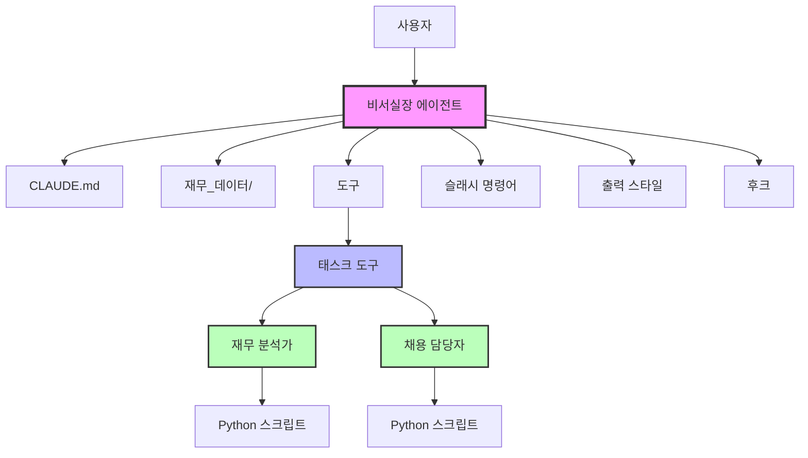
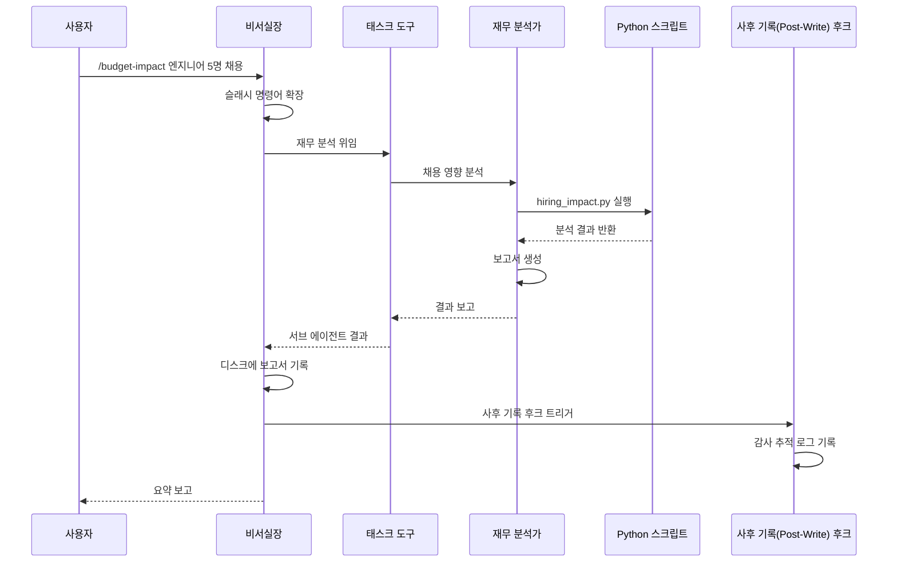

# 비서실장(Chief of Staff) 에이전트 아키텍처

```mermaid
graph TD
    User[사용자] --> Chief[비서실장 에이전트]
    Chief --> Memory[CLAUDE.md]
    Chief --> FinData[재무_데이터/]
    Chief --> Tools[도구]
    Chief --> Commands[슬래시 명령어]
    Chief --> Styles[출력 스타일]
    Chief --> Hooks[후크]

    Tools --> Task[태스크 도구]
    Task --> FA[재무 분석가]
    Task --> Recruiter[채용 담당자]

    FA --> Scripts1[Python 스크립트]
    Recruiter --> Scripts2[Python 스크립트]

    style Chief fill:#f9f,stroke:#333,stroke-width:3px
    style Task fill:#bbf,stroke:#333,stroke-width:2px
    style FA fill:#bfb,stroke:#333,stroke-width:2px
    style Recruiter fill:#bfb,stroke:#333,stroke-width:2px
```

## 예상 에이전트 통신 흐름

```mermaid
sequenceDiagram
    participant User as 사용자
    participant Chief as 비서실장
    participant Task as 태스크 도구
    participant FA as 재무 분석가
    participant Scripts as Python 스크립트
    participant Hooks as 사후 기록(Post-Write) 후크
    User->>Chief: /budget-impact 엔지니어 5명 채용
    Chief->>Chief: 슬래시 명령어 확장
    Chief->>Task: 재무 분석 위임
    Task->>FA: 채용 영향 분석
    FA->>Scripts: hiring_impact.py 실행
    Scripts-->>FA: 분석 결과 반환
    FA->>FA: 보고서 생성
    FA-->>Task: 결과 보고
    Task-->>Chief: 서브 에이전트 결과
    Chief->>Chief: 디스크에 보고서 기록
    Chief->>Hooks: 사후 기록 후크 트리거
    Hooks->>Hooks: 감사 추적 로그 기록
    Chief-->>User: 요약 보고
```
    
