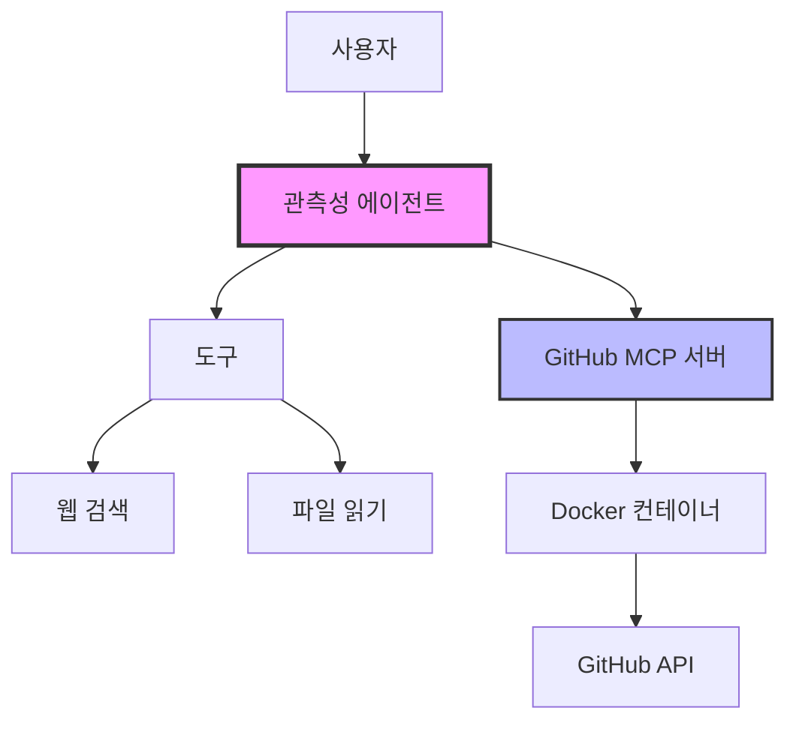
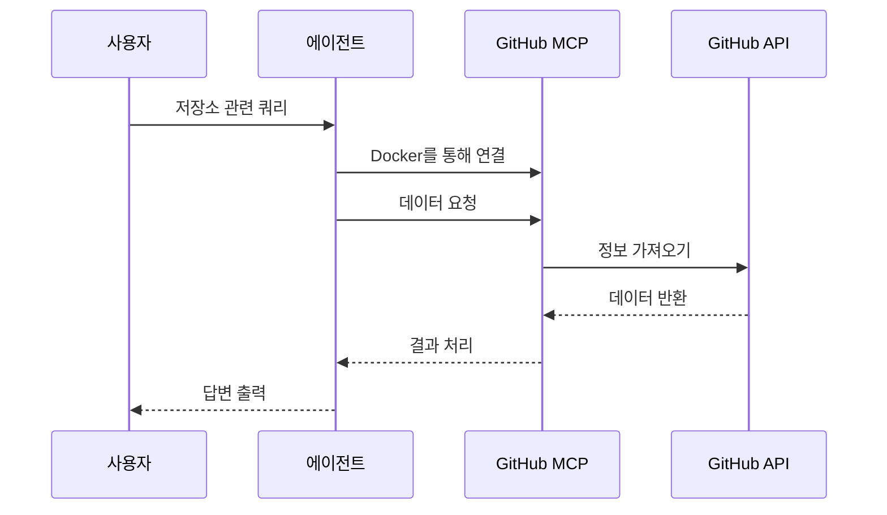

# 관측성 (Observability) 에이전트 아키텍처

```mermaid
graph TD
    User[사용자] --> Agent[관측성 에이전트]
    Agent --> GitHub[GitHub MCP 서버]

    Agent --> Tools[도구]
    Tools --> WebSearch[웹 검색]
    Tools --> Read[파일 읽기]

    GitHub --> Docker[Docker 컨테이너]
    Docker --> API[GitHub API]

    style Agent fill:#f9f,stroke:#333,stroke-width:3px
    style GitHub fill:#bbf,stroke:#333,stroke-width:2px
```

# 통신 흐름 다이어그램

```mermaid
sequenceDiagram
    participant User as 사용자
    participant Agent as 에이전트
    participant MCP as GitHub MCP
    participant API as GitHub API

    User->>Agent: 저장소 관련 쿼리
    Agent->>MCP: Docker를 통해 연결
    Agent->>MCP: 데이터 요청
    MCP->>API: 정보 가져오기
    API-->>MCP: 데이터 반환
    MCP-->>Agent: 결과 처리
    Agent-->>User: 답변 출력
```
    