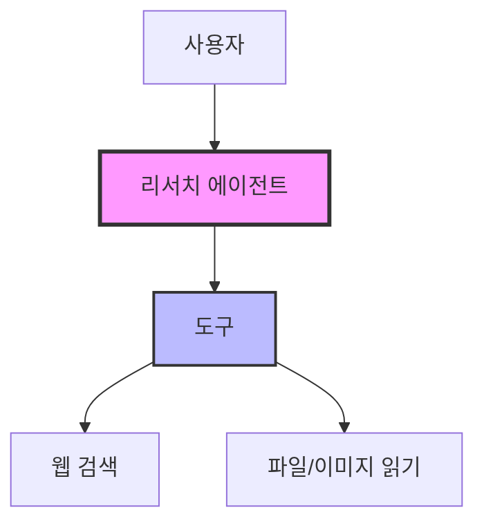
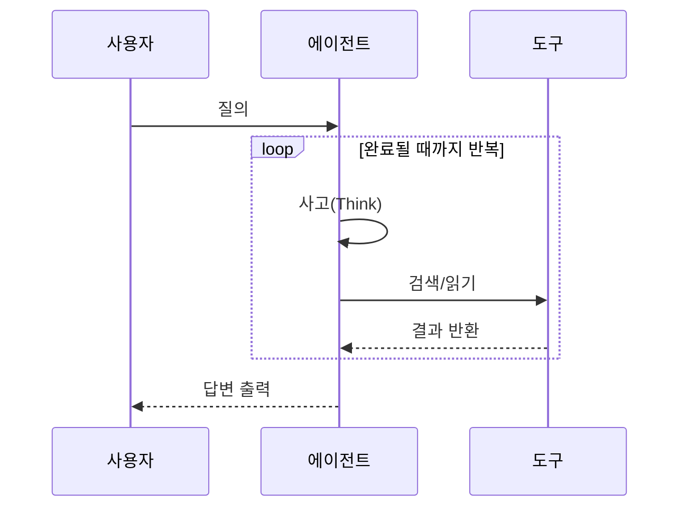

# 리서치 에이전트 아키텍처

```mermaid
graph TD
    User[사용자] --> Agent[리서치 에이전트]
    Agent --> Tools[도구]

    Tools --> WebSearch[웹 검색]
    Tools --> Read[파일/이미지 읽기]

    style Agent fill:#f9f,stroke:#333,stroke-width:3px
    style Tools fill:#bbf,stroke:#333,stroke-width:2px
```

# 통신 흐름 다이어그램

```mermaid
sequenceDiagram
    participant User as 사용자
    participant Agent as 에이전트
    participant Tools as 도구

    User->>Agent: 질의

    loop 완료될 때까지 반복
        Agent->>Agent: 사고(Think)
        Agent->>Tools: 검색/읽기
        Tools-->>Agent: 결과 반환
    end

    Agent-->>User: 답변 출력
```
    